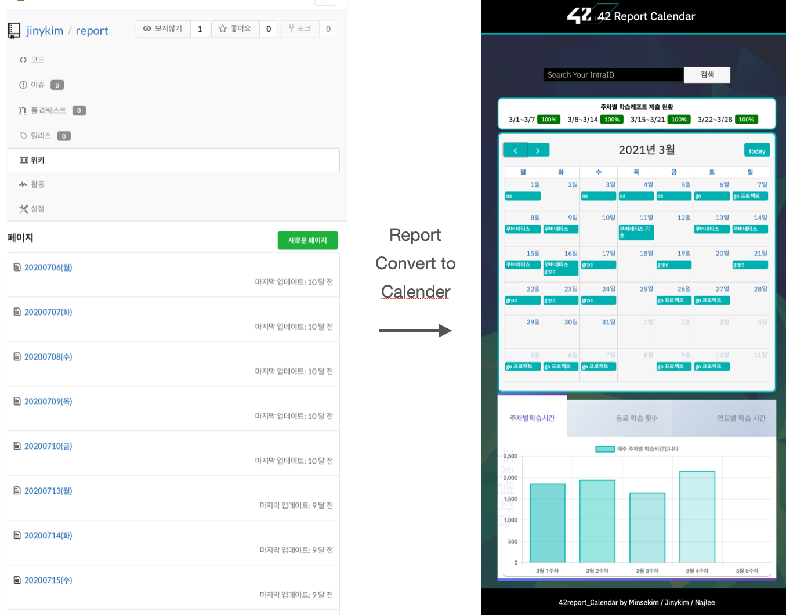

# 42report\_calender\_server
View report to calender [42report.today](http://42report.today)

## Build & Run
> git clone https://github.com/jinykim0x80/42report\_calender\_server && cd 42report\_calender\_server

> sudo docker build -t 42report\_calender .

> sudo docker network create report\_net 

> sudo docker run -it --rm --network report\_net -p 80:80 42report\_calender

## Tech Stack
+ Language 
	+ go 1.15
		+ rpc
		+ net/http
		+ encoding/json
		+ git
		+ gitea API 
		+ 42 API
		+ etc..
+ Build
	+ docker
+ Deploy
	+ AWS ec2

## Writting about This Project
+ [Go 서버 애플리케이션을 Docker로 AWS EC2에 배포](https://cafemocamoca.tistory.com/309)

## Front-end
[front-end-github](https://github.com/Mins97/42-Report-Calendar)

### Contributer
+ [Mins97](https://github.com/Mins97)
+ [najeong12](https://github.com/najeong12)
